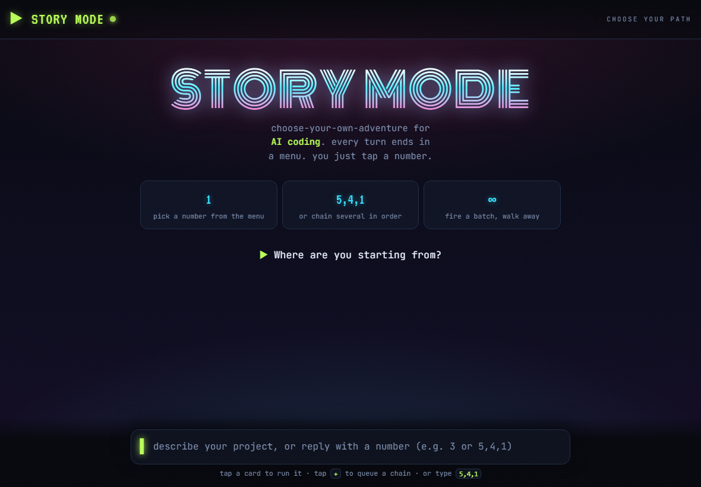

# Claude Code Story Mode

Turn an AI coding session into a choose-your-own-adventure. After every
response, the assistant ends with a ranked menu of the ten most likely things
you'd want next. Reply with a number. Or chain several — `5,4,1` runs them in
that order. Navigate an entire build from a phone with one thumb.



> Status: v1 scaffold. The **engine** (menu grammar, chained-pick contract,
> metrics) is complete and portable. The **web app** is a working skeleton.

## Why it exists

Typing full instructions is the slowest part of working with an AI agent. Most
of the time the next move is one of a small, predictable set. Story Mode surfaces
that set as a numbered menu so the interaction collapses to a tap. It is the old
text-adventure loop — *"You are in a room. Exits: north, south"* — pointed at
your own codebase.

**Pseudo-parallelism — the real unlock.** Chain a reply like `1,3,5,6,7` and you
launch a whole batch of intentions in a single tap, with *zero serial thinking
time on your end*. From your seat it feels parallel: you fire everything at once
and walk away. Under the hood v1 runs the chain in order; the parallelism that
matters is the human's — you stop deliberating move-by-move and just steer. (True
concurrent execution of independent picks is a v2 optimization, not the point.)

## How it works: Engine + Profile

The product is two separable parts. This is the whole architecture.

- **Engine** (`engine/`) — generic, user-agnostic, public. The menu-generation
  contract, the chained-pick grammar parser, and the catch-rate metrics. None of
  it knows anything about you.
- **Profile** (`profiles/`) — your *signature moves*: the classes of action you
  tend to take (`approve_and_continue`, `adjust_scope`, `formalize`, `push_public`,
  `ask_why`, …) and how you like menus ranked. The engine ranks each menu using
  your profile. A new user starts from `demo.json` and the app grows their profile
  from their own pick history. **Your profile never ships with the engine.**

That split is why this is a real product and not a personal hack: the mechanism
is shared; the personalization is yours and grows as you use it.

## The chained-pick grammar (the novel part)

A reply is interpreted against the previous menu:

| Reply | Meaning |
|---|---|
| `3` | run menu item 3 |
| `5,4,1` | run items 5, 4, 1 **in that literal order** (order encodes intent) |
| `3: only the auth part` | run item 3 with a small tweak |
| `story loop 4` | autonomously run the top item for the next 4 turns |

Chain-resolution contract (`engine/chained_pick.py`): literal order; on a
contradiction the *later* item wins; a terminal "stop/hold" item halts the chain;
a missing dependency reorders minimally; a failure halts rather than blind-continues;
an already-done item is skipped. Outward/irreversible items (`send`, `deploy`,
`push`, `delete`, `post`) are marked `⚠` so a phone-tapper sees the consequence
before tapping.

### Collision-resistance: disjoint keyspaces

A numbered menu collides whenever the response itself contains a numbered list the
user might also pick from. A bare `3` is then ambiguous: menu-item 3 or content-item 3?

Story Mode resolves this by construction with two namespaces that cannot overlap:

- **No content list present** — standard numbered menu (`1`–`10`). A bare `3`
  unambiguously means menu-item 3.
- **A content list IS present** — the menu switches to letter keys `a`–`j` (the
  title changes to say so). A bare `3` then unambiguously picks from the content
  list; a bare `c` unambiguously picks menu-item 3.

The parser in `engine/chained_pick.py` is told which keyspace the last menu used,
via `parse_reply(prompt, menu_keyspace="number" | "letter")`. This matters in both
directions:

- In **number** mode, a bare letter is treated as prose, not a pick — so a one-word
  reply like `a` or `i` (both English words) does not silently fire menu-item 1 or 9.
- In **letter** mode, a bare number is flagged as a `content_pick` (a selection from
  the response's content list), not a menu pick.

Because letters `a`–`j` and digits `1`–`10` are disjoint sets *and* the parser knows
the active keyspace, a bare token decodes to exactly one namespace every turn.

## Layout

```
engine/        generic core (LLM-agnostic)
  menu_spec.md     the menu-generation contract handed to the model each turn
  chained_pick.py  parse + resolve a user reply against the last menu
  metrics.py       catch-rate / recall@10 / precision@3 on pick history
profiles/
  demo.json        generic starter profile (no real user in it)
web/             v1 standalone web app (reimplements the loop; calls Claude API)
  index.html  app.js  server.js
docs/
  lastmenu-design.md  paraphrase-detection (flagship v2 feature, designed)
```

## Tests

```bash
python -m pytest -q tests/
```

## Run the web app (skeleton)

```bash
npm install
export ANTHROPIC_API_KEY=sk-...
npm start          # serves web/ and proxies the model loop via server.js
```

## License

MIT. This is a gift to the Claude Code community.
